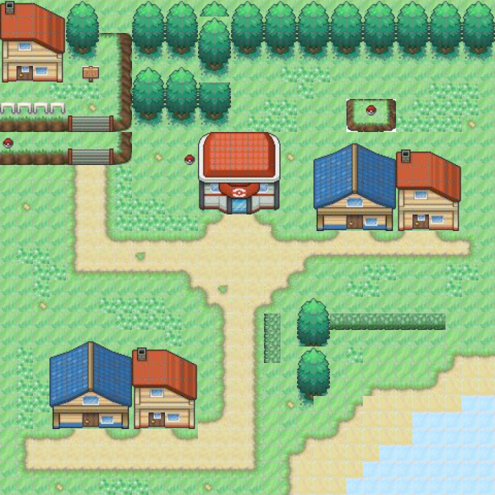

<div align="center">
    
    <h1>
        <b>
          Pokemap
        </b>
    </h1>
    <h3>Pokemon map generator</h3>
    </br>
    </br>
    
</div>

# 📃 Description of the project

Project realised in the IAS (Artificial Intelligence) module at ENIB.
The aim of this project is to explore the procedural generation of content, by procedurally generating levels of video games inspired by the Pokémon universe.

We wanted to use the Tiled tool inside the project in order to be able to edit tilemaps (tmx file) using Tilesets (tsx files). These are usable files in XML format. It also allows exporting to image format.

First of all, we implemented the procedural generation of our map by defining rules for placing the different elements. Then in a second step, we reused the previously generated map as an input file to generate a new map using the Wave Function Collapse (WFC) algorithm.

We have encountered problems using the WFC, with .tmx files, so we convert them into an image (wfc.png). Once the WFC has finished and generated the output image, we re-convert the map to .tmx format to view it in the Tiled software.

We used the following technologies for the first part:
- Noise Perlin: algo used to generate the relief
- A*: to generate the paths between the houses

After running the programme, the following files are created:
- /assets/pokemap.tmx: procedurally generated map
- /assets/pokemap-generated.tmx: map generated via WFC
- /assets/wfc.png: temporary image sent to the WFC input.
- /assets/wfc-generated.png: temporary image generated by WFC


# 📂 Contents of the repository

The src directory contains 3 files:
- Tiled.cs: to manipulate the Tiled files
- PokemonLevelRandomizer.cs: main file
- MapGenerator: generator 

The assets directory contains the following files:
- Terrain.tsx: tileset of the project
- Terrain.png: image of the tileset

# 📦 Installation


1. Install the 2D level editing tool Tiled [tiled](https://www.mapeditor.org/)

2. Clone the GitHub repository to your directory
```bash
git clone https://github.com/dorianleveque/Pokemap.git
```

3. Going to the directory using a terminal
```bash
cd Pokemap
```

# 📜 Running

To execute the project, simply execute the following command inside the project

```bash
dotnet run <size> <HouseCount> <?Seed>
```

Example: The following command will generate a map of 200 by 200 with 50 houses with seed 12353 as seed.
```bash
dotnet run 200 50 12353
dotnet run 200 50 johto
```

# ⚠ Be careful

If nothing happens during the execution, you may have filled in too many houses or there may be only ocean. This can be solved by changing the input parameters.
